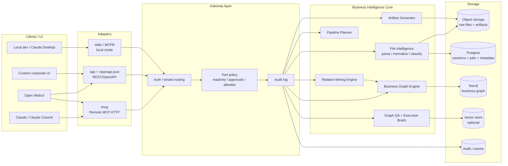

# Architecture

## Target architecture



## Design principles

1. **Core first, MCP second** — бизнес-логика не должна зависеть от Claude/Cowork/Open WebUI.
2. **Evidence-first** — каждая подтверждённая связь должна иметь источник: файл, лист, ячейка, цитата, формула или правило.
3. **Candidate workflow** — LLM-гипотезы не становятся фактами без подтверждения.
4. **Read-only by default** — MVP анализирует и проектирует, но не меняет внешние системы.
5. **File IDs over raw paths** — production API должен работать с `file_id`, не с произвольными путями.
6. **Small MCP toolset** — лучше 8–12 крупных инструментов, чем 50 мелких.

## Migration from legacy package

Current legacy package is stored in:

```text
legacy/relation-memory-cowork/
```

Use it as a reference for:

- existing FastMCP tools;
- relation memory engine;
- Neo4j persistence;
- Excel dependency rules;
- candidate approval flow.

Do not keep the final product named `relation-memory-cowork`. The target name is `business-graph-mcp`.
